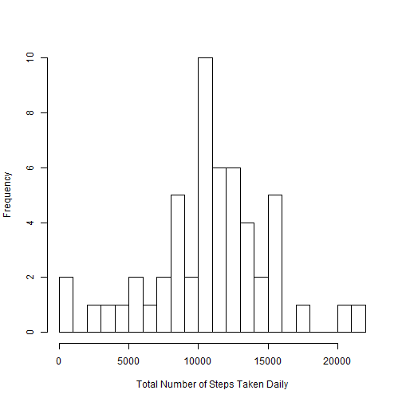
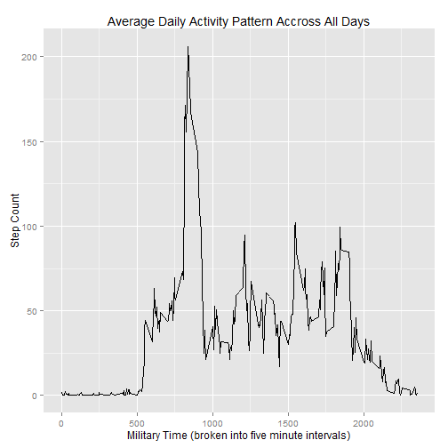
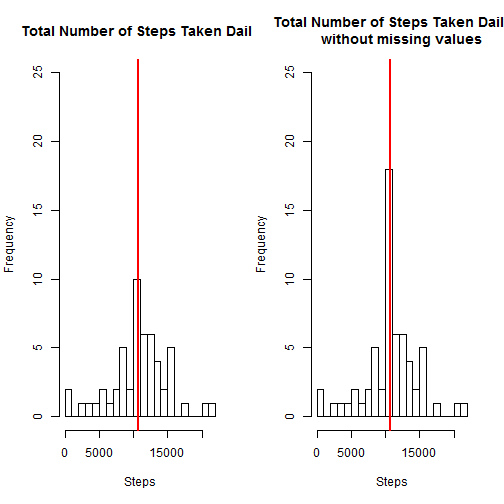
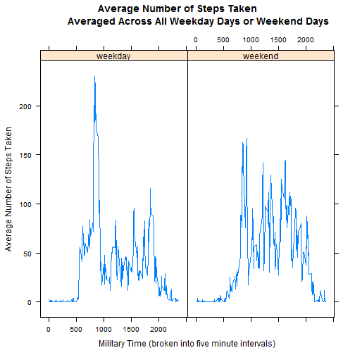

Reproducible Research: Peer Assignment 1
========
  
January 2015

  
## Objective
The objective of this assignment is to create a **single R Markdown** document that can be
processed by **knitr** and be transformed into an HTML file. The goal is to practice creating
reproducible research while answering the questions detailed below.
    
The GitHub repository for this assignment has been fork/cloned.
  
    
## Data
This assignment makes use of data from a personal activity monitoring device. This device
collects data at 5 minute intervals through out the day. The data consists of two months of
data from an anonymous individual collected during the months of October and November, 2012
and includes the number of steps taken in 5 minute intervals each day.
  
The variables included in this dataset are:

 - steps: Number of steps taking in a 5-minute interval (missing values are coded as NA)

 - date: The date on which the measurement was taken in YYYY-MM-DD format

 - interval: Identifier for the 5-minute interval in which measurement was taken  
  
  
The dataset is stored in a comma-separated-value (CSV) file on this GitHub site and there are
a total of 17,568 observations in this dataset.  

The original data set came from: [Activity monitoring data](https://d396qusza40orc.cloudfront
.net/repdata%2Fdata%2Factivity.zip).


## Loading and Processing the Data


### Loading  
Make sure that the data file is saved as a zip file in the current R working directory as 
"activity.zip" and run the below code.

```r
data <- read.table(unz("activity.zip", "activity.csv"), header = TRUE, quote = "\"'",
                   sep = ",")
```

### Processing
Look at a summary of the data to insure reasonability and to be aware of what is contained
within the data set.

```r
str(data)
```

```
## 'data.frame':	17568 obs. of  3 variables:
##  $ steps   : int  NA NA NA NA NA NA NA NA NA NA ...
##  $ date    : Factor w/ 61 levels "2012-10-01","2012-10-02",..: 1 1 1 1 1 1 1 1 1 1 ...
##  $ interval: int  0 5 10 15 20 25 30 35 40 45 ...
```

The date field in the data needs to be converted to a date data type.

```r
data$date <- as.Date(data$date)
str(data)
```

```
## 'data.frame':	17568 obs. of  3 variables:
##  $ steps   : int  NA NA NA NA NA NA NA NA NA NA ...
##  $ date    : Date, format: "2012-10-01" "2012-10-01" ...
##  $ interval: int  0 5 10 15 20 25 30 35 40 45 ...
```
  
There is also 'NA' in the step field a number of times.

```r
missing.data <- sum(is.na(data$steps))
missing.data
```

```
## [1] 2304
```
  
There are 2304 missing data elements.
  
    
## What is the mean total number of steps taken per day?  
To calculate the total steps taken per day, ignore all missing data in the data set and sum
the steps for each day. 

```r
# ignoring missing data
data.nona <- na.omit(data)

# convert the data into daily sums instead of five minute increments
daily.steps <- rowsum(data.nona$steps, format(data.nona$date, '%Y-%m-%d'))
daily.steps <- data.frame(daily.steps)
names(daily.steps) <- ("steps")
```
  
Plot a histogram of the total number of steps taken per day.

```r
hist(daily.steps$steps, main = " ", breaks = 25, xlab = "Total Number of Steps Taken Daily")
```

 
  
Calculate the mean and median total number of steps taken per day.

```r
mean.steps <- mean(daily.steps$steps)
mean.steps
```

```
## [1] 10766.19
```

```r
median.steps <- median(daily.steps$steps)
median.steps
```

```
## [1] 10765
```
  
The mean total number of steps taken per day is 1.0766189 &times; 10<sup>4</sup> and the median is
10765.
  
## What is the average daily activity pattern?
To calculate the average daily activity pattern, again ignore all missing data in the data
set and calculate the average number of steps for each five minute interval throughout the
day.

```r
library(plyr)

# calculate the average steps for each five minute interval throughout the day
interval.mean <- ddply(data.nona, ~interval, summarise, mean = mean(steps))
```
  
Plot a time series of the five minute intervals and the average number of steps taken, averaged across all days.

```r
library(ggplot2)

qplot(x = interval, y = mean, data = interval.mean, geom = "line", 
      xlab = "Military Time (broken into five minute intervals)", 
      ylab = "Step Count", main = "Average Daily Activity Pattern Accross All Days")
```

 
  
Report the five minute interaval, on average across all the days in the dataset, which
contains the maximum number of steps.

```r
interval.max <- interval.mean[which.max(interval.mean$mean),]
interval.max
```

```
##     interval     mean
## 104      835 206.1698
```
  
Based on these results, the acivity peak for the day is around 835
military time (8:35am).  
  
    
## Imputting missing values  
Because all missing data was ignored, there could be some bias in the calculations and
summaries presented. How much does this impact the results?  
First find how many missing data points are in the data set. (Note: this was also completed
above)

```r
missing.data <- sum(is.na(data))
total.rows <- nrow(data)
percentage.missing <- missing.data / total.rows * 100
```

Of the 17568 rows of data, 2304 have missing data. This is 
13.1147541%, a significant amount.  
  
In an attempt to limit the impact that missing data will have on the results of these
calculations, the strategy implemented to imput the missing data will be to use the mean for
the five minute intervals that are missing. To do this, create a new data set that is the
same as the original data set and then populate the missing data points with the calculated
mean for the five minute interval already completed above "interval.mean". To do this, use an
SQL query.

```r
library(sqldf)
```

```
## Loading required package: gsubfn
## Loading required package: proto
## Loading required package: RSQLite
## Loading required package: DBI
```

```r
complete.data <- sqldf('
                       select d.*, i.mean
                       from "data" as d
                       join "interval.mean" as i
                       on d.interval = i.interval
                       order by d.date, d.interval')
```

```
## Loading required package: tcltk
```

```r
complete.data$steps[is.na(complete.data$steps)] <- complete.data$mean[is.na(complete.data$steps)]
new.missing.data <- sum(is.na(complete.data))
```
  
Now there exists a data set with 0 missing values. All calculations can be
recomputed using this new data set.  
  
### What is the mean total number of steps taken per day?  
To calculate the total steps taken per day, and sum the steps for each day. 

```r
complete.daily.steps <- rowsum(complete.data$steps, format(complete.data$date, '%Y-%m-%d'))
complete.daily.steps <- data.frame(complete.daily.steps)
names(complete.daily.steps) <- ("steps")
```
  
Plot a histogram of the total number of steps taken per day using the complete data set
compared to the original.

```r
par(mfrow = c(1,2))
# original data histogram
hist(daily.steps$steps, main = "Total Number of Steps Taken Daily", breaks = 25, 
     xlab = "Steps", ylim = c(0, 25))
abline(v = median(daily.steps$steps), col = 2, lwd = 2)
# new data histogram
hist(complete.daily.steps$steps, main = "Total Number of Steps Taken Daily
     without missing values", breaks = 25, xlab = "Steps", ylim = c(0, 25))
abline(v = median(complete.daily.steps$steps), col = 2, lwd = 2)
```

 
  
Calculate the mean and median total number of steps taken per day using the complete data set
.

```r
complete.mean.steps <- mean(complete.daily.steps$steps)
mean.difference <- complete.mean.steps - mean.steps
complete.mean.steps
```

```
## [1] 10766.19
```

```r
complete.median.steps <- median(complete.daily.steps$steps)
median.difference <- complete.median.steps - median.steps
complete.median.steps
```

```
## [1] 10766.19
```
  
The mean total number of steps taken per day with the mean data substituted in for missing
data is 1.0766189 &times; 10<sup>4</sup> and the median is 1.0766189 &times; 10<sup>4</sup>. This demonstrate
s that the originally calculated mean and the newly calculated mean have a differences of 
0. This is because, adding the mean value to itself and then dividing by
the number of times you added it will not have an impact on the mean. The median difference
between the originally calculated value and the newly calculated value is 
1.1886792. The original median increased to be the same as the mean because it
was added to the data set 2304 times.
  

## Are there differences in actrivity patterns between weekdays and weekends?
To calculate any activity difference between weekdays and weekends, use the data set without
missing values.  
  
Create a new data set that contains the data split by a new factor variable that indicates
wether the date is a weekend or weekday. 

```r
complete.data$weektime <- as.factor(ifelse(weekdays(complete.data$date) %in% 
                                           c("Saturday", "Sunday"), "weekend",
                                           "weekday"))

week.data <- sqldf('
                   select interval, avg(steps) as "mean", weektime
                   from "complete.data"
                   group by weektime, interval
                   order by interval')
```
  
Create a panel plot containing a time series plot of the five minute interval and the average
number of steps taken, averaged across all weekday days or weekend days.

```r
library(lattice)

plot <- xyplot(mean ~ interval | factor(weektime), data = week.data, type = 'l', 
               main = "Average Number of Steps Taken
               Averaged Across All Weekday Days or Weekend Days", 
               xlab = "Military Time (broken into five minute intervals)", 
               ylab = "Average Number of Steps Taken")
print(plot)
```

 

```r
week.data[which.max(week.data$mean),]
```

```
##     interval     mean weektime
## 207      835 230.3782  weekday
```
  
This plot demonstrates that in general, activity is increased on weekend days but that the
maximum activity in a five minute period is still the morning of a weekday day.
